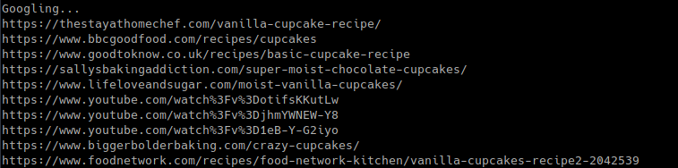

# GOOGLER

This program makes a Google search with your 'query' and opens the first 'n' result(s) on default browser. Like "I'm feeling lucky" button but with more results.

#### Installation

```
$ git clone https://github/aytekk/googler.git
$ cd googler/
$ pip3 install requirements.txt
```
#### Usage

```
python3 googler.py [-h] query n

positional arguments:
  query       search query
  num         number of links to open (default=3)

optional arguments:
  -h, --help  show this help message and exit
```

#### Example

`$ python3 googler.py 'how to make cupcake' 4`


